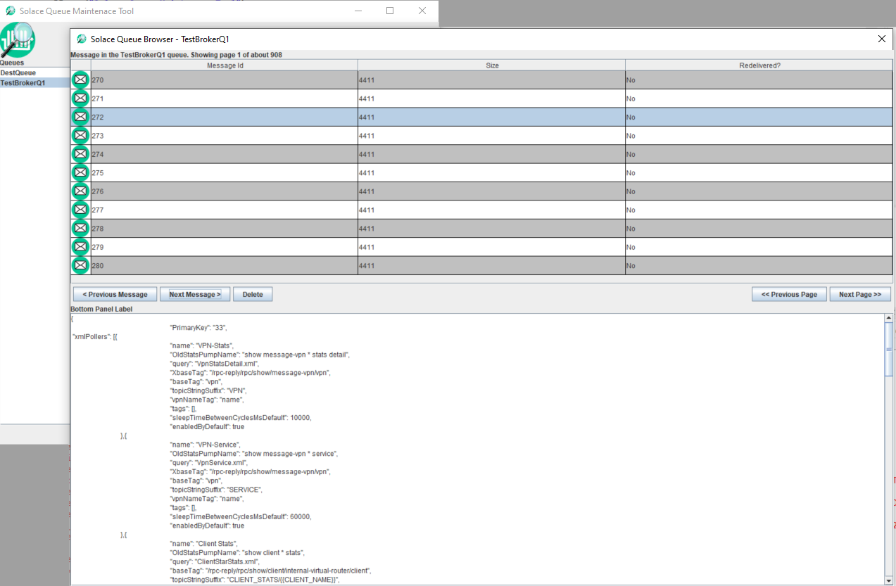

# SolaceQueueBrowserGui
Desktop GUI for browsing Solace Queues


Solace products do not provide any way to see the contents of messages, which is often a critical requirement for managing queues. There are a variety of use cases where operators need to inspect the messages in a queue, and sometimes delete them. 

##### Motivations for this tool
This tool aims to offer a solution that is easy to secure basic credentials, does not require allowing  Cross-Origin Resource Sharing (CORS), has a nice user interface and is highly performant.

## Important disclaimer
This tool is NOT a Solace supported product. It has been created by Solace's professional services team to augment Solace products. 

## Building the tool
The tool can be built with Maven, or with your favorite IDE. Dependant jarfiles are contained in the repo, so you just need to include all the jars in the lib folder in your classpatth.

Clone teh repo:
> git clone <this repo>

Compile and build jar:
> mvn clean package

The build script creates a self-contained executable fat jar.

## Runing without building

The latest build is contained in the repo. Simply run the jar contained in the target folder, using the instriuctions for running below.

## Configuring the tool
The tool currently supports a connectrion to asingle broker. The broker URL and credentials are defined in a json file that this tool read in at launch time. You pass this file into the tool when you run it. See the example config file in the config/sampleBrowserConfig.json, described below:

```json
{
	"eventBroker": {
		"name": "A Logical Name for your Broker",
		"sempHost": "https://mr-connection-REPLACEWITHYOURURL.messaging.solace.cloud:943/SEMP/v2/config",
		"sempAdminUser": "mission-control-manager",
		"sempAdminPw": "REPLACE-ME",
		"msgVpnName": "replace-me",
		"messagingHost": "tcps://mr-connection-REPLACEWITHYOURURL.messaging.solace.cloud:55443",
		"messagingClientUsername": "solace-cloud-client",
		"messagingPw" : "replace-me"
	}
}
```
Note that this tool requires both admin credentials and message client credentials. It requires the admin credentials to use the SEMP api to pull a list of queues on the broker. Themessaging interface is then used to browse a selected queue. 

To obtain this information from a Solace Cloud based broker:
1. Admin creds: go to the Solace Cloud console, click on your broker, then click on "Manage" and open the "SEMP - REST API" section in the area below the tiles. 
2. Messaging creds: go to the Solace Cloud console, click on your broker, then click on "Connect". Open the "Solace Messaging" area. The creds are displayed there.  

## Running the tool
> java -jar target/SolaceQueueBrowserGui-1.0.0-jar-with-dependencies.jar -c=<path to your config file>

## Feedback?
Send feature requests, defects and comments to (mailto:mike.obrien@solace.com)


